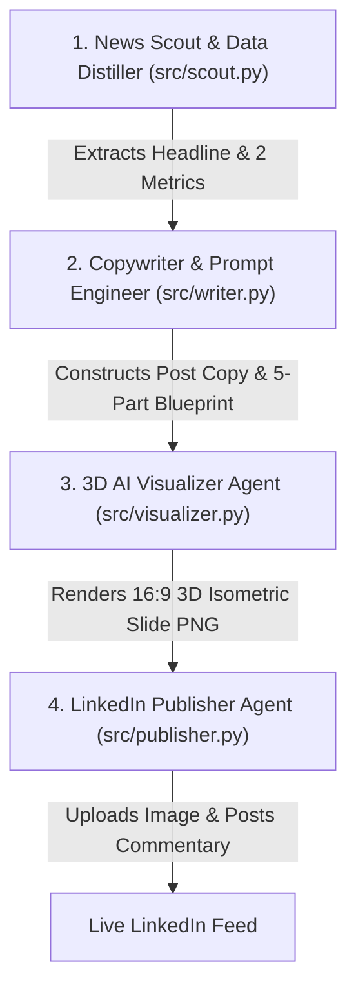

# EcoPulse LinkedIn Engine 🚀

Autonomous 4-step pipeline that scouts environmental engineering insights, crafts high-converting LinkedIn post commentary, constructs a **5-Part Prompt Blueprint** for 3D Isometric Infographic Slides, and publishes directly to LinkedIn.

---

## 🎨 3D AI Infographic Slide Blueprint

Every slide image generated by the engine uses the **5-Part Prompt Blueprint**:

```text
[1. TITLE & THEME] + [2. COLOR & AESTHETIC] + [3. 3D ISOMETRIC DIAGRAM] + [4. SIDE-BY-SIDE DATA CARDS] + [5. TYPOGRAPHY & RATIO]
```

---

## 🔄 4-Step Pipeline Architecture



---

## 🛠️ Setup & Secrets

Set the following GitHub Secrets in **Settings → Secrets and variables → Actions**:

| Secret Name | Description |
|---|---|
| `LINKEDIN_ACCESS_TOKEN` | OAuth2 Access Token with `w_member_social` scope |
| `LINKEDIN_PERSON_URN` | Member URN, format: `urn:li:person:XXXXXXXX` |
| `OPENAI_API_KEY` | OpenAI API key for DALL-E 3 slide generation |

---

## 🧪 Local Dry-Run Testing

```bash
pip install -r requirements.txt
export ECOPULSE_DRY_RUN=true
python engine.py
```
